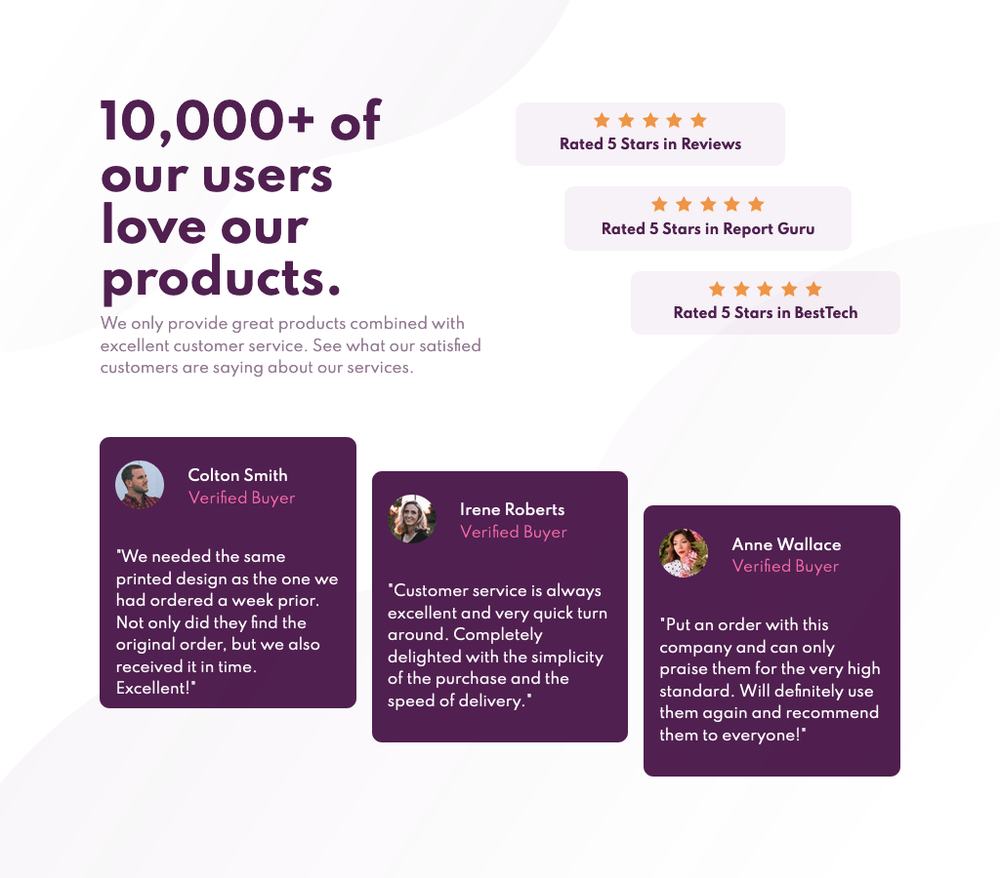
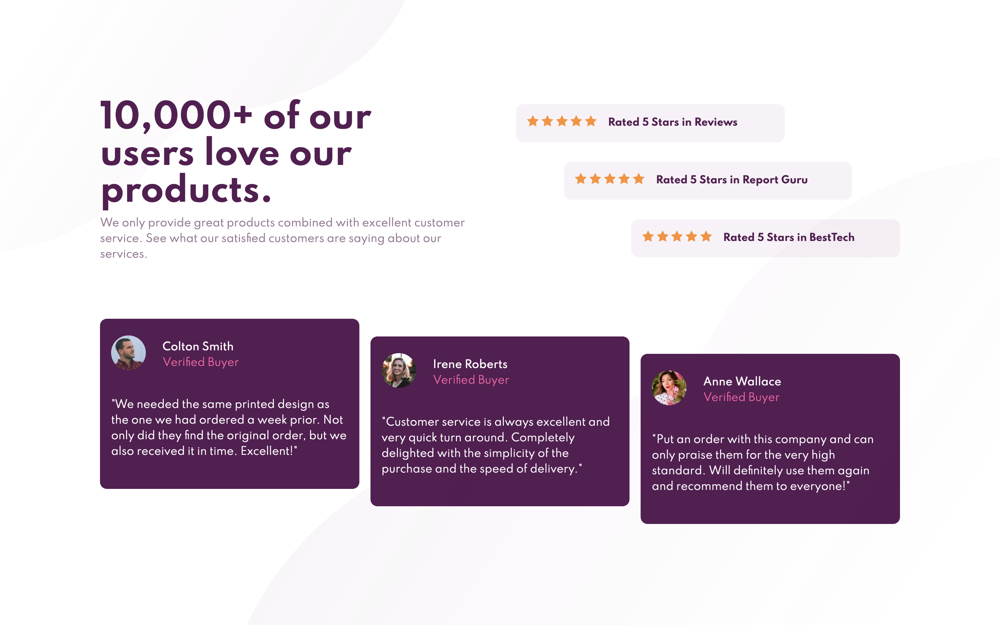

# Frontend Mentor - Social proof section solution

This is a solution to the [Social proof section challenge on Frontend Mentor](https://www.frontendmentor.io/challenges/social-proof-section-6e0qTv_bA).

## Table of contents

- [Frontend Mentor - Social proof section solution](#frontend-mentor---social-proof-section-solution)
  - [Table of contents](#table-of-contents)
  - [Overview](#overview)
    - [The challenge](#the-challenge)
    - [Screenshots](#screenshots)
    - [Links](#links)
  - [My process](#my-process)
    - [Built with](#built-with)
    - [What I learned](#what-i-learned)
    - [Continued development](#continued-development)
    - [Useful resources](#useful-resources)
  - [Author](#author)

## Overview

### The challenge

Users should be able to:

- View the optimal layout for the section depending on their device's screen size

### Screenshots

| 375px                                                                                | 375px-2                                                                                 |375px-3|
| ------------------------------------------------------------------------------------- | --------------------------------------------------------------------------------------- |----------|
|  |  |  

|810px|
|-----|
| |

|1024px|
|-----|
| |

|1440px|
|-----|
| |

### Links

- Live Site URL: [https://rauf-dev.github.io/fm_social-proof-section/](https://rauf-dev.github.io/fm_social-proof-section/)

## My process
Started off in mobile layout with globals like fonts, colors, typography, images.
Then completed the mobile layout with margins and paddings.
Followed this by adding the background images to mobile layout.
Next started using media queries to gradually add complexity with wider desktop layout.

### Built with

- Semantic HTML5 markup
- CSS custom properties
- Flexbox
- CSS Grid
- Mobile-first workflow

### What I learned

- Unless you have years of experience, double or even triple your time estimate.

- Mobile layout is always easy(er). Start with it.

- Save time by planning the layout on paper/figma/mentally etc including responsiveness of the inner elements. Rating section with the 5 stars and text below/next could have been completed faster.

- ***On the wrapper container, use padding (instead of margin) in **percent %**. This saves tons of padding and margin adjustments on inner elements to retain position when viewpoint is getting larger.***

### Continued development

Get more practice with css grid and revisit this project, do same using grid.

### Useful resources

- [Understanding Flex Grow Shrink Basis](https://css-tricks.com/understanding-flex-grow-flex-shrink-and-flex-basis/) - This is agood article which helped me finally understand flexbox shorthand for grow-shrink-basis. I'd recommend it to anyone still learning this concept.

## Author

- Website - [raUF!](https://www.heyrauf.com)
- Frontend Mentor - [@raUF!](https://www.frontendmentor.io/profile/yourusername)

